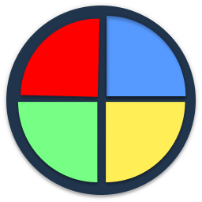

# CLASSIC SIMON GAME

This app was bootstrap with parcel and uses react 16.8.6.

The game is currently deployed through netlify and is playable [here](https://perfectparadox-simongame.netlify.com/)

[](https://app.netlify.com/sites/perfectparadox-simongame/deploys)



### Usage & Installation

You are free to clone or download and make this project your own.

```
git clone 'https://github.com/abregorivas/simon.git
cd simon
npm install
npm run dev

```

### How to play

The goal is to repeat the increasing random light/sound signals that Simon generates.

You can play the game [here](https://perfectparadox-simongame.netlify.com/)

1. Press Start button.
2. Repeat the signal by pressing the same color sequence.
3. SIMON will duplicate the first signal and will add one new signal on the next round.
4. Again repeat the signals by pressing the same same color as Simons Sequenct.
5. Continue in this manner as long as you can repeat each se-quence of signals correctly.
6. There are a total of 50 sequences. Try to get to 50

#### Stict Mode

If your strict mode is "ON" and you fail to repeat a sequence exactly it is Game Over.
If your strict mode is "OFF" then you will be able to try the sequence again.

### Contribution

You are welcome to contribute to the game by forking and making a pull request

The following are some features I am considering to add and would welcome any contributors

1. Add a difficulty levels. This would increase the pace of the game after every nth round
2. Add an infinite mode
3. Provide a history of your past scores
4. Add a timer to limit the time you have to make a move
